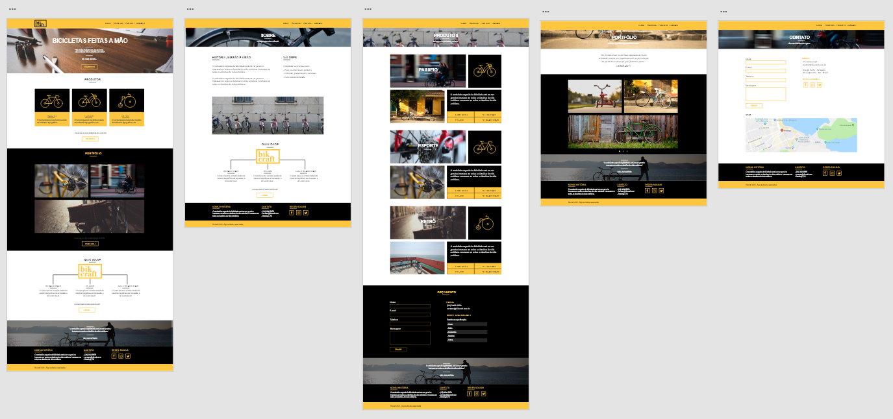

# #1 Bikcraft

Este é um projeto desenvolvido durante o curso de Web Design da Origamid.

Muito além de código, o curso proporcionou uma visão melhor para o desenvolvimento web em mim, mesmo que eu já tenha experiência com desenvolvimento. 
A partir do que é passado pude aprender dicas preciosas que tornam um site muito mais atrativo, passando por design, prototipação, escolha dos elementos visuais corretos, codificação, dicas do que funciona em um site, hospedagem e até mesmo analytics.

### Sobre o projeto criado ###
O projeto Bikcraft consiste de um website de uma fábrica de bicicletas. Nele, são apresentadas bicicletas personalizadas para compra, pedido de orçamento por formulário, página de contatos, portfólio e produtos.

**Algumas coisas utilizadas**
- Adobe XD
- PHPMailer
- OG tags
- Normalize CSS
- Flexbox
- Wireframe 
- Cyberduck
- etc...

**Protótipo**: (Feito com o Adobe XD).  <a href="./img/prototipo">Clique qui para ver os protótipos ampliados</a>




### O que eu aprendi?
Algumas coisas que foram novas para mim durante essa jornada e algumas que foram reforçadas.

***CSS***
- A propriedade ```margin: 0 auto;``` do CSS faz com que o elemento centralize, automaticamente nas margens esquerda e direita.
- Dá pra criar linhas com as pseudopropriedades do CSS ```:after``` e ```:before,``` fazendo ```content: ""``` e definindo o tamanho da linha com ```heigh``` e ```width```;
- Colocando duas classes juntas, por exemplo ```class="btn btn-preto"```, no css ```.btn.btn-preto``` , a segunda classe irá sobrescrever a primeira, usando as definições padrão e mudando as coisas necessárias que sejam específicas para o elemento.
- Além de ```text-align: center``` pode usar também ```text-align: right``` para textos, que não seja o ```float```. Um exemplo é nos itens de um menu de um site, para deixá-los (a lista) na direita.
- Usar ```letter-spacing: .1em``` e ```line-height: 20px``` dá uma visão bonita ao fonte.
- Nas definições de CSS os arquivos de CSS listados por último irão sobrescrever os primeiros.
- Dá pra colocar inclusive imagens com background:url("../img/linhas.svg"); com o ```:after.``` Usando ```position:absolute``` dá pra ajustar essa imagem mais livremente pelo layout.


**HTML**
- Sempre usar ```alt``` nas imagens.

**Geral**
- Antes de criar o protótipo final do site, criar o wireframe "limpo", sem cores, sem fontes, pensando só na ideia que irá querer, no conteúdo que terá. Deixar para preocupar com o visual depois de feito isso.
- É interessante usar sempre o Lorem Ipsum em português. Ao escrever o texto final é ideal seguir o número de caracteres que está no Lorem Ipsum do protótipo para manter a definição.
- Site útil para analatycs: Gerar mapas de calor (gratuito para um projeto):
[https://www.clicktale.com/](https://www.clicktale.com/)

***Media queries coringas***
<p> Estilos para tablets <br>
 <code>@media only screen and (min-width: 768px) and (max-width: 979px) {}</code>
</p>

<p> 
 Estilos para smartphones <br>
 <code>@media only screen and (max-width: 787px) {}</code>
</p>

